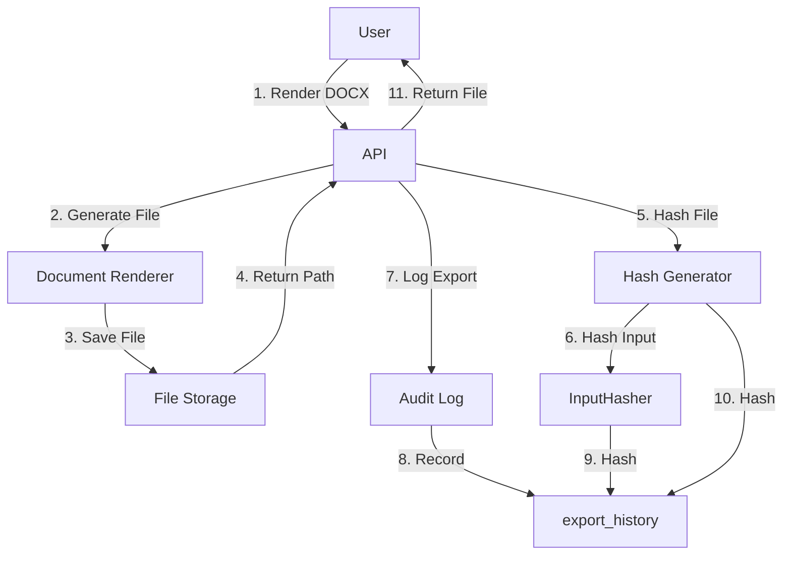

# AUTH GOVERNANCE PHASE 1 — AUDIT LOG AND EXPORT HISTORY DESIGN

**Date:** 2026-06-30
**Phase:** Phase 8 — Audit Log and Export History Design

---

## 1. Audit Event Model

### 1.1 Event Taxonomy

```typescript
type AuditEventCategory =
  | 'auth'           // Authentication events
  | 'case'           // Case operations
  | 'document'       // Document operations
  | 'template'       // Form template operations
  | 'permission'     // Permission changes
  | 'user'           // User management
  | 'agency'         // Agency management
  | 'export';        // Export operations
```

### 1.2 Event Registry

| Event Type | Category | Actor | Resource | Immutable | Retention |
|------------|----------|-------|----------|-----------|-----------|
| `auth.login` | auth | user | — | Yes | 7 years |
| `auth.logout` | auth | user | — | Yes | 7 years |
| `auth.login_failed` | auth | user | — | Yes | 7 years |
| `auth.password_changed` | auth | user | — | Yes | 7 years |
| `auth.session_revoked` | auth | user | — | Yes | 7 years |
| `case.created` | case | user | case | Yes | 7 years |
| `case.updated` | case | user | case | Yes | 7 years |
| `case.archived` | case | user | case | Yes | 7 years |
| `document.created` | document | user | document | Yes | 7 years |
| `document.form_saved` | document | user | document | Yes | 7 years |
| `document.exported_docx` | export | user | document | Yes | 7 years |
| `document.exported_pdf` | export | user | document | Yes | 7 years |
| `document.file_downloaded` | export | user | document | Yes | 7 years |
| `document.file_deleted` | document | user | document | Yes | 7 years |
| `template.draft_created` | template | user | template | Yes | 7 years |
| `template.draft_updated` | template | user | template | Yes | 7 years |
| `template.submitted_review` | template | user | template | Yes | 7 years |
| `template.approved` | template | user | template | Yes | 7 years |
| `template.rejected` | template | user | template | Yes | 7 years |
| `template.published` | template | user | template | Yes | 7 years |
| `template.archived` | template | user | template | Yes | 7 years |
| `permission.granted` | permission | admin | user + permission | Yes | 7 years |
| `permission.revoked` | permission | admin | user + permission | Yes | 7 years |
| `user.invited` | user | admin | user | Yes | 7 years |
| `user.disabled` | user | admin | user | Yes | 7 years |
| `user.enabled` | user | admin | user | Yes | 7 years |
| `agency.updated` | agency | admin | agency | Yes | 7 years |
| `report.exported` | export | user | report | Yes | 7 years |

---

## 2. Audit Log Schema

### 2.1 Event Structure

```typescript
interface AuditLogEntry {
  // Identity
  id: string;
  eventId: string;           // UUID for deduplication

  // Actor (who did it)
  actorUserId: string | null;
  actorName: string | null;
  actorProvider: 'clerk' | 'auth0' | 'local' | null;
  actorProviderId: string | null;

  // Context (where/when)
  agencyId: string | null;
  sessionId: string | null;
  requestId: string | null;
  ipAddress: string | null;
  userAgent: string | null;

  // Action
  eventType: string;
  category: AuditEventCategory;

  // Resource (what was affected)
  resourceType: string | null;
  resourceId: string | null;

  // Changes
  beforeHash: string | null;
  afterHash: string | null;

  // Metadata
  metadataJson: Record<string, unknown> | null;

  // Timestamps
  createdAt: Date;

  // Compliance
  isImmutable: boolean;
  retainedUntil: Date | null;
}
```

### 2.2 Event Metadata

```typescript
// auth.login
{
  loginMethod: 'password' | 'sso' | 'mfa',
  provider: 'clerk' | 'auth0',
  mfaMethod?: 'totp' | 'sms',
}

// document.exported_docx
{
  templateCode: string;
  templateVersion: string;
  contractHash: string;
  inputSnapshotHash: string;
  exportedFileHash: string;
  exportedFileSize: number;
  caseId?: string;
}

// permission.granted
{
  targetUserId: string;
  targetUserName: string;
  permissionCode: string;
  agencyId?: string;
  scope?: string;
}
```

---

## 3. Export Traceability Model

### 3.1 Export Flow



### 3.2 Export Record Structure

```typescript
interface ExportRecord {
  // Identity
  id: string;

  // Document context
  documentId: string;
  templateCode: string;
  templateVersionId: string;
  caseId: string | null;

  // Actor
  userId: string;
  userName: string;
  agencyId: string;

  // Format
  format: 'DOCX' | 'PDF';

  // Traceability hashes
  inputSnapshotHash: string;    // Hash of form inputs at export time
  contractHash: string;          // Hash of form contract version
  exportedFileHash: string;      // SHA-256 of exported file

  // File info
  exportedFileName: string;
  exportedFilePath: string;
  exportedFileSizeBytes: number;

  // Context
  ipAddress: string | null;
  userAgent: string | null;
  exportedAt: Date;

  // Integrity
  auditLogId: string;
}
```

---

## 4. Document Integrity Chain

### 4.1 Hash Computation

```typescript
// Input snapshot hash (form data at export time)
function computeInputSnapshotHash(formInputs: Record<string, unknown>): string {
  const snapshot = JSON.stringify(formInputs, Object.keys(formInputs).sort());
  return sha256(snapshot);
}

// Contract hash (form contract version)
function computeContractHash(contractVersion: FormContractVersion): string {
  return sha256(JSON.stringify({
    templateId: contractVersion.template_id,
    version: contractVersion.version_no,
    revision: contractVersion.revision,
    baseHash: contractVersion.base_contract_hash,
    compiledHash: contractVersion.contract_hash,
    updatedAt: contractVersion.updated_at,
  }));
}

// Exported file hash
async function computeFileHash(filePath: string): Promise<string> {
  const content = await fs.readFile(filePath);
  return sha256(content);
}
```

### 4.2 Integrity Verification

```typescript
// Verify document integrity
async function verifyDocumentIntegrity(exportRecord: ExportRecord): Promise<{
  isValid: boolean;
  errors: string[];
}> {
  const errors: string[] = [];

  // Verify file exists
  if (!await fs.pathExists(exportRecord.exportedFilePath)) {
    errors.push('Exported file not found');
  }

  // Verify file hash
  if (errors.length === 0) {
    const actualHash = await computeFileHash(exportRecord.exportedFilePath);
    if (actualHash !== exportRecord.exportedFileHash) {
      errors.push('File hash mismatch — file may have been tampered with');
    }
  }

  return {
    isValid: errors.length === 0,
    errors,
  };
}
```

---

## 5. Audit Query Service

### 5.1 Query Interface

```typescript
interface AuditQuery {
  // Filters
  actorUserId?: string;
  agencyId?: string;
  eventTypes?: string[];
  categories?: AuditEventCategory[];
  resourceType?: string;
  resourceId?: string;
  dateFrom?: Date;
  dateTo?: Date;

  // Pagination
  page?: number;
  pageSize?: number;

  // Sorting
  sortBy?: 'createdAt' | 'eventType';
  sortOrder?: 'asc' | 'desc';
}

interface AuditQueryResult {
  entries: AuditLogEntry[];
  total: number;
  page: number;
  pageSize: number;
  totalPages: number;
}
```

### 5.2 Query Examples

```typescript
// Get all exports for a specific document
await auditService.query({
  resourceType: 'document',
  resourceId: '12345',
  eventTypes: ['document.exported_docx', 'document.exported_pdf'],
  pageSize: 100,
});

// Get all permission changes in an agency
await auditService.query({
  agencyId: '67890',
  categories: ['permission'],
  dateFrom: subDays(new Date(), 30),
});

// Get all actions by a specific user
await auditService.query({
  actorUserId: 'user_123',
  pageSize: 50,
});
```

---

## 6. Compliance Features

### 6.1 Immutability

```typescript
// Events marked as immutable cannot be deleted or modified
@Injectable()
export class AuditService {
  async createAuditEntry(entry: CreateAuditEntry): Promise<AuditLogEntry> {
    const isImmutable = IMMUTABLE_EVENTS.has(entry.eventType);

    return this.prisma.audit_logs.create({
      data: {
        ...entry,
        is_immutable: isImmutable,
        retained_until: isImmutable
          ? addYears(new Date(), 7)
          : null,
      },
    });
  }

  // Prevent modification of immutable events
  async updateAuditEntry(id: string, data: Partial<AuditLogEntry>): Promise<void> {
    const existing = await this.prisma.audit_logs.findUnique({ where: { id } });

    if (existing?.is_immutable) {
      throw new ForbiddenException('Cannot modify immutable audit entry');
    }

    await this.prisma.audit_logs.update({ where: { id }, data });
  }
}
```

### 6.2 Retention Policy

```typescript
// Scheduled job to purge expired audit entries
@Injectable()
export class AuditRetentionService {
  @Cron(CronExpression.EVERY_DAY_AT_MIDNIGHT)
  async purgeExpiredEntries(): Promise<void> {
    const now = new Date();

    const result = await this.prisma.audit_logs.deleteMany({
      where: {
        is_immutable: false,
        retained_until: { lt: now },
      },
    });

    this.logger.log(`Purged ${result.count} expired audit entries`);
  }
}
```

---

## 7. Privacy Considerations

### 7.1 PII Handling

| Field | PII | Handling |
|-------|-----|----------|
| `actorName` | Yes | Stored for audit purposes |
| `ipAddress` | Yes | Stored, anonymized after 90 days |
| `userAgent` | No | Stored for security analysis |
| `metadataJson` | Depends | Reviewed before storing |

### 7.2 Retention Schedule

| Event Type | Retention | Legal Basis |
|-----------|-----------|-------------|
| Auth events | 7 years | Security audit requirement |
| Case operations | 7 years | Legal compliance |
| Document exports | 7 years | Legal compliance |
| Permission changes | 7 years | Access control audit |
| User management | 7 years | HR/compliance |

---

## 8. Export History UI

### 8.1 Export History Panel

**Route:** `/documents/[documentId]/export-history`

**Features:**
- List all exports for a document
- Show export metadata (who, when, format)
- Verify integrity (hash check)
- Download audit report
- Filter by date range, format, user

### 8.2 Export Certificate

**For legal compliance, export a certificate:**

```typescript
interface ExportCertificate {
  certificateId: string;
  documentId: string;
  templateCode: string;
  exportedAt: Date;
  exportedBy: {
    name: string;
    agency: string;
    role: string;
  };
  hashes: {
    inputSnapshot: string;
    contractVersion: string;
    exportedFile: string;
  };
  verifiedAt: Date;
  verifiedBy: string;
}
```
