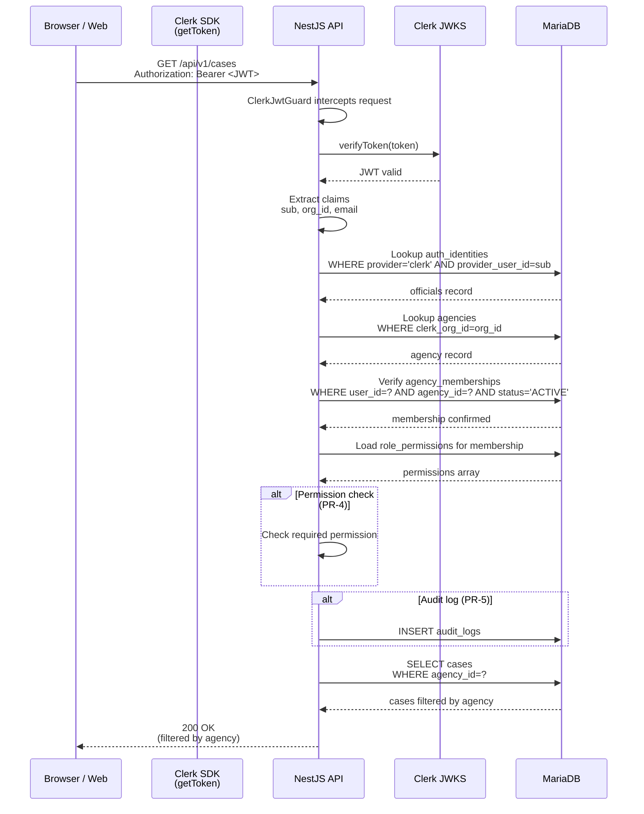
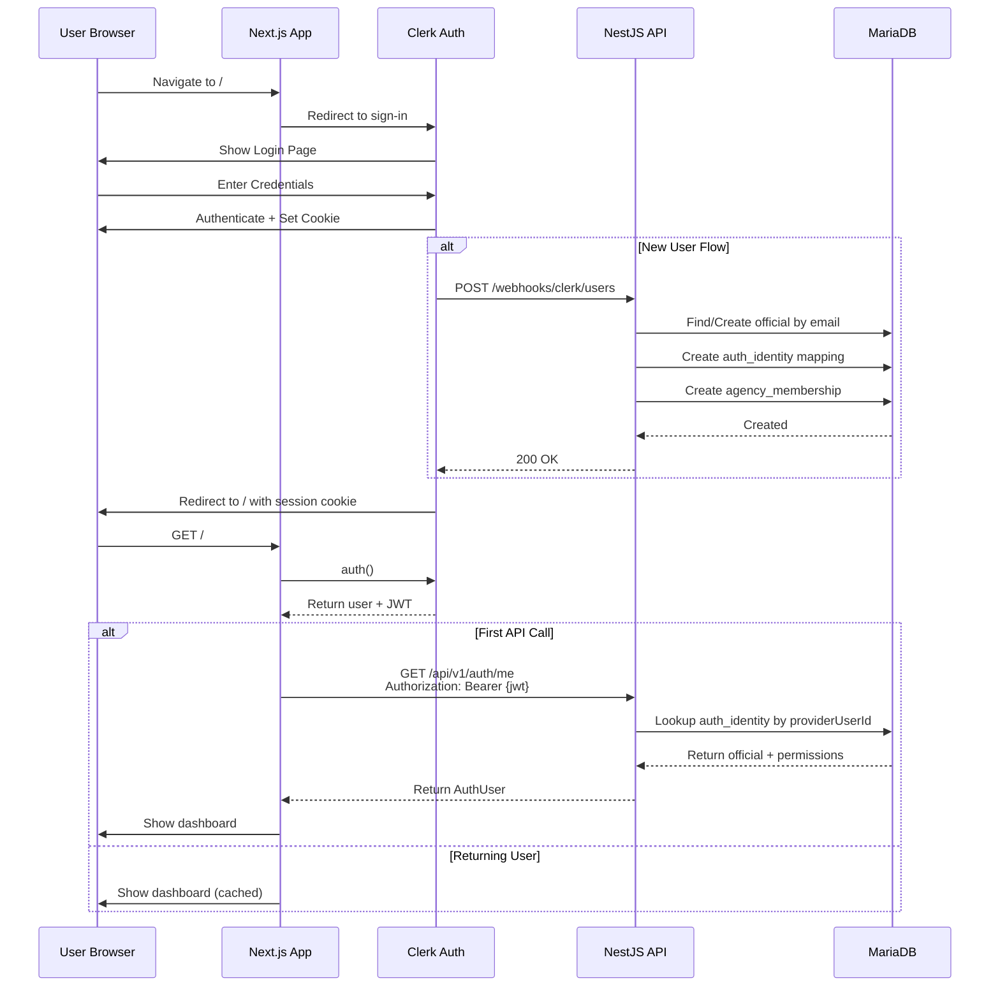
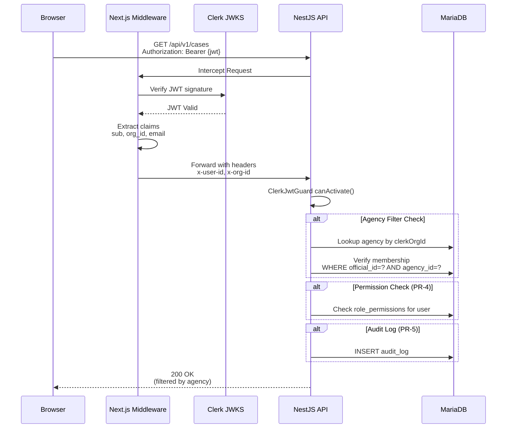
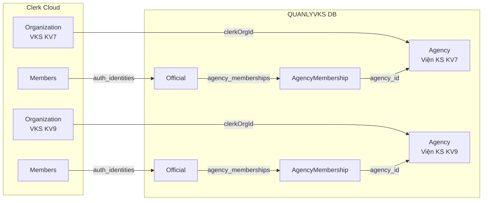
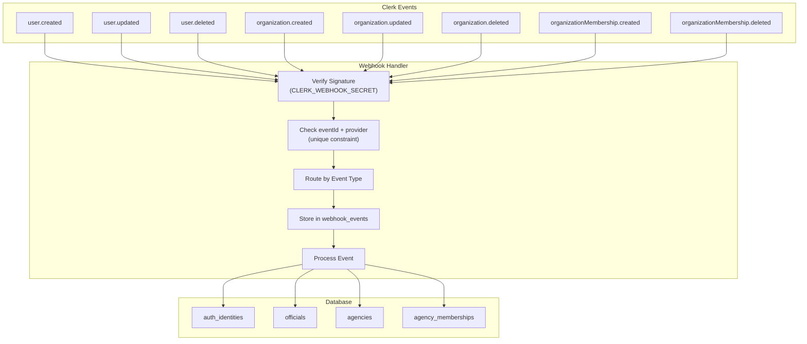

# AUTH GOVERNANCE PHASE 1 — CLERK TARGET ARCHITECTURE

**Date:** 2026-06-30
**Phase:** Phase 5 — Clerk Target Architecture (PATCHED: Phase 1B)
**Provider:** Clerk (user-confirmed 2026-06-30)

---

## 1. Design Principles

### Clerk for

- **Identity** — user identity, sign-in/sign-out UX
- **Session management** — cookie-based sessions via Clerk SDK
- **Organization context** — Clerk Organizations map to QUANLYVKS agencies
- **UserButton / OrganizationSwitcher** — web UI components
- **Basic route protection** — middleware-based

### QUANLYVKS Database for

- **Legal/business permissions** — role policy, permission enforcement
- **Agency membership projection** — AgencyMembership table
- **Audit log** — immutable event record
- **Export history** — document lineage traceability
- **Template governance** — form lifecycle management
- **Permission override** — per-user grant/revoke
- **Immutable traceability** — legal compliance requirements

### Do Not

- Let Clerk become the **only** business-authorization source of truth
- Rely solely on Clerk org roles for legal/business authorization
- Trust client-provided agencyId without server-side membership verification

---

## 2. Web Architecture

### 2.1 Files Likely to Change in PR-1

```
apps/web/src/
  app/layout.tsx                    # Add ClerkProvider
  middleware.ts                     # Clerk route protection (web routes only)
  app/sign-in/[[...sign-in]]/page.tsx    # Clerk sign-in
  app/sign-up/[[...sign-up]]/page.tsx    # Clerk sign-up
  components/layout/topbar.tsx       # Add UserButton
  lib/api-client.ts                 # Adds Bearer <JWT> header for API calls
  .env.example                     # Clerk env vars
  .env.docker.example              # Clerk env vars (docker)
```

### 2.2 Protected Route Groups

**Public routes** (no auth required):
- `/sign-in(.*)`
- `/sign-up(.*)`
- `/health` (if exists)
- Public assets

**Authenticated routes** (auth required, no RBAC yet in PR-1):
- `/`
- `/templates`
- `/documents(.*)`
- `/cases(.*)`
- `/reports(.*)`

**Admin/protected** (DB RBAC enforced in PR-4):
- `/admin(.*)`
- `/admin/form-studio(.*)`
- `/admin/form-studio/permissions(.*)`

> **PR-1 scope note:** PR-1 requires only authentication (user is logged in), not final RBAC. Admin route protection is in PR-4.

### 2.3 Middleware Design

```typescript
// apps/web/src/middleware.ts
import { clerkMiddleware, createRouteMatcher } from '@clerk/nextjs/server';

const isPublicRoute = createRouteMatcher([
  '/sign-in(.*)',
  '/sign-up(.*)',
  '/health',
]);

const isProtectedRoute = createRouteMatcher([
  '/(.*)',
]);

export default clerkMiddleware((auth, req) => {
  if (!isPublicRoute(req)) {
    auth().protect();
  }
});

export const config = {
  matcher: ['/((?!.*\\..*|_next).*)', '/'],
};
```

### 2.4 ClerkProvider

```typescript
// apps/web/src/app/layout.tsx
import { ClerkProvider } from '@clerk/nextjs';

export default function RootLayout({ children }) {
  return (
    <ClerkProvider>
      <html lang="vi">
        <body>{children}</body>
      </html>
    </ClerkProvider>
  );
}
```

### 2.5 Topbar UserButton

```typescript
// apps/web/src/components/layout/topbar.tsx
import { UserButton } from '@clerk/nextjs';

export function Topbar() {
  return (
    <header>
      {/* ... existing topbar content ... */}
      <UserButton afterSignOutUrl="/sign-in" />
    </header>
  );
}
```

---

## 3. API Architecture (PR-3 target)

### 3.0 Separation of Concerns

> **Critical:** Next.js `clerkMiddleware()` protects **web/Next.js routes only**. It does **not** intercept requests to the separate NestJS API. API security is enforced independently by `ClerkJwtGuard` in PR-3.

```
┌──────────────────────────────────────────────────────────────────────┐
│ Browser / Web App (Next.js)                                          │
│  clerkMiddleware() → protects /, /templates, /documents, /admin/*    │
│  Clerk SDK           → getToken() returns Bearer <JWT>              │
└──────────────────────────────────────────────────────────────────────┘
                    │ Authorization: Bearer <JWT>
                    ▼
┌──────────────────────────────────────────────────────────────────────┐
│ NestJS API (separate process, port 3001)                             │
│  ClerkJwtGuard → verify JWT against Clerk JWKS                        │
│  AgencyContextGuard → verify agency membership in DB                   │
│  PermissionGuard → enforce DB role_permissions                       │
│  AuditService → write audit_logs                                      │
└──────────────────────────────────────────────────────────────────────┘
                    │
                    ▼
┌──────────────────────────────────────────────────────────────────────┐
│ MariaDB (QUANLYVKS DB — authoritative for business permissions)     │
│  officials, agencies, agency_memberships, role_permissions, etc.    │
└──────────────────────────────────────────────────────────────────────┘
```

### 3.1 API Bearer Token Validation Flow



### 3.2 Token Validation (ClerkJwtGuard)

```typescript
// apps/api/src/modules/auth/guards/clerk-jwt.guard.ts
// PR-3: Verify Clerk JWT and inject user context into request.
// This guard lives in NestJS, NOT in Next.js middleware.

@Injectable()
export class ClerkJwtGuard implements CanActivate {
  async canActivate(context: ExecutionContext): Promise<boolean> {
    const request = context.switchToHttp().getRequest<Request>();
    const authHeader = request.headers.authorization;

    if (!authHeader?.startsWith('Bearer ')) {
      throw new UnauthorizedException('Missing bearer token');
    }

    const token = authHeader.slice(7);
    const payload = await this.verifyToken(token);

    // Extract from Clerk JWT claims
    (request as any).currentUser = {
      id: payload.sub,                          // providerUserId
      orgId: payload.org_id,                   // active Clerk org
      email: payload.email,
      publicMetadata: payload.public_metadata,  // role, permissions
    };

    return true;
  }
}
```

### 3.3 Agency Mapping

> **Important:** Do not rely on client-provided agencyId without verifying membership.

```typescript
// Agency membership must be verified server-side (in NestJS)
async function verifyAgencyMembership(userId: string, orgId: string): Promise<boolean> {
  // Map Clerk org_id to QUANLYVKS agency
  const agency = await this.prisma.agencies.findFirst({
    where: { clerkOrgId: orgId },
  });
  if (!agency) return false;

  // Verify user is a member
  const membership = await this.prisma.agencyMemberships.findFirst({
    where: {
      officialId: userId,
      agencyId: agency.id,
      status: 'ACTIVE',
    },
  });

  return !!membership;
}
```

### 3.4 Request Context Injection

```typescript
// Inject into all controllers/services
export interface RequestUserContext {
  id: string;              // Clerk user ID (sub)
  orgId: string | null;   // Active Clerk org ID
  email: string;
  agencyId?: number;      // Mapped QUANLYVKS agency
  role?: string;          // From public_metadata
  permissions?: string[];  // From public_metadata
}
```

---

## 4. DB Projection

### 4.1 Local DB is Authoritative For

| Table | Purpose |
|-------|---------|
| `officials` | User accounts |
| `agencies` | Organizations |
| `agency_memberships` | User-agency mapping |
| `auth_identities` | Provider identity mapping |
| `roles` | Role catalog |
| `permissions` | Permission catalog |
| `role_permissions` | Role-permission mapping |
| `membership_roles` | Membership-role assignment |
| `audit_logs` | Immutable audit trail |
| `export_history` | Document export traceability |

### 4.2 Clerk Identity Mapping

```typescript
// auth_identities table maps Clerk identity to local user
interface AuthIdentity {
  id: bigint;
  provider: 'clerk';          // "clerk" only for this phase
  providerUserId: string;     // Clerk user ID (sub)
  userId: bigint;             // FK to officials table
  emailSnapshot: string;
  createdAt: Date;
  updatedAt: Date;

  // Unique constraint: (provider, providerUserId)
}
```

### 4.3 Agency Mapping

```typescript
// agencies table extends with Clerk org link
interface Agency {
  id: bigint;
  name: string;
  code: string;
  clerkOrgId: string | null;  // Maps to Clerk Organization
  parentAgencyId: bigint | null;
  status: 'ACTIVE' | 'INACTIVE';
  createdAt: Date;
  updatedAt: Date;

  // Unique constraint: clerkOrgId
}
```

---

## 5. Webhook Sync

### 5.1 Events to Handle

| Event | Action |
|-------|--------|
| `user.created` | Create auth_identity + officials entry |
| `user.updated` | Update email snapshot, display name |
| `user.deleted` | Disable official or mark deleted |
| `organization.created` | Create agency with clerkOrgId |
| `organization.updated` | Update agency name/code |
| `organization.deleted` | Deactivate agency |
| `organizationMembership.created` | Create agency_membership |
| `organizationMembership.updated` | Update membership status/role |
| `organizationMembership.deleted` | Remove or suspend membership |

### 5.2 Idempotency

```typescript
// Every webhook must be idempotent
interface ProviderWebhookEvent {
  id: bigint;
  provider: 'clerk';
  eventId: string;         // Clerk event ID
  eventType: string;       // e.g. "user.created"
  payloadHash: string;    // SHA-256 of raw payload
  status: 'PROCESSING' | 'PROCESSED' | 'FAILED';
  processedAt: Date | null;
  errorMessage: string | null;
  createdAt: Date;

  // Unique constraint: (provider, eventId)
}
```

---

## 6. RBAC Split: Clerk vs DB

### Clerk Provides (Coarse Context)

- `org_id` — active organization
- `org_role` — organization role (admin/member)
- `public_metadata.role` — app role hint
- `public_metadata.permissions` — permission hint

### DB Enforces (Authoritative)

- `officials.role` — final app role
- `role_permissions` — authoritative permission catalog
- `membership_roles` — role assignment per agency
- `user_role_overrides` — per-user grant/revoke

### Separation of Concerns

```
Clerk org context → maps to QUANLYVKS agency
Clerk org role → maps to QUANLYVKS membership role
Clerk public_metadata → hint only, not authoritative
QUANLYVKS role_permissions → final authorization
QUANLYVKS agency_memberships → final agency membership
```

---

## 7. Mermaid Diagrams

### 7.1 Login Flow



### 7.2 Authenticated Web Request Flow



### 7.3 Clerk Organization to QUANLYVKS Agency Mapping



### 7.4 Webhook Sync Flow



---

## 8. Session vs JWT Decision

**Decision: Use JWT Bearer tokens for API, not cookies.**

Rationale:
1. **Separate API:** QUANLYVKS has a separate NestJS API. JWT is the natural choice.
2. **Cross-origin:** JWT Bearer tokens work well with CORS.
3. **No cookies needed:** Browser stores session via Clerk SDK.
4. **Stateless validation:** NestJS validates JWTs directly against Clerk's JWKS.

---

## 9. Next Steps

This architecture is designed for implementation in the following PR sequence:

| PR | Focus | Architecture Element |
|----|-------|---------------------|
| PR-1 | Clerk Foundation | ClerkProvider, middleware, sign-in pages, UserButton |
| PR-2 | User/Agency Projection | auth_identities, agency_memberships, webhook sync |
| PR-3 | API JWT Validation | ClerkJwtGuard, agency mapping |
| PR-4 | RBAC Guards | permission guards, agency scoping, self-approval |
| PR-5 | Audit Logging | audit_logs, event model |
| PR-6 | Export History | export_history, document traceability |
| PR-7 | E2E Migration | test helpers, role-based tests |
