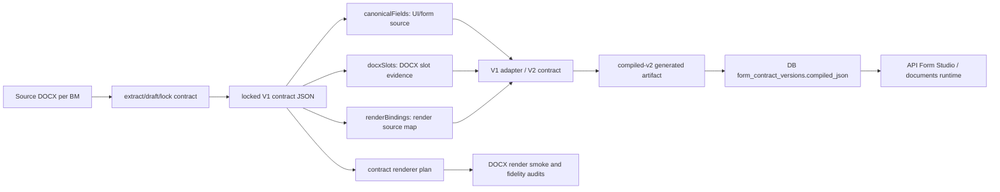

# 213 BM Contract Recovery Implementation Plan

> **For agentic workers:** REQUIRED SUB-SKILL: Use superpowers:subagent-driven-development (recommended) or superpowers:executing-plans to implement this plan task-by-task. Steps use checkbox (`- [ ]`) syntax for tracking.

**Goal:** Bring all 213 TT 03/2026 BM contracts, UI schemas, compiled artifacts, DB published contracts, and DOCX render paths back to a single verified source of truth.

**Architecture:** Treat `docs/audit/docx/contracts/locked/*.contract.locked.json` as the reviewed contract corpus, `canonicalFields` as the user-visible form field source of truth, `docxSlots` as DOCX placeholder/slot evidence, `compiled-v2` as generated artifact only, and `form_contract_versions` as runtime DB publication. Fix the pipeline and gates before applying any broad BM batch.

**Tech Stack:** Node.js 22, pnpm 10, TypeScript, NestJS, Next.js, Prisma MariaDB, Docker Compose, DOCX contract audit scripts.

---

## Evidence Snapshot

Collected on 2026-06-27 in `D:\Study\Project\QLLaw-main`.

### Initial Snapshot

- `docs/audit/forms-root-cause/latest.json`: `totalIssues=3353`, `FAIL=1747`, `REVIEW=1606`.
- Issue categories:
  - `COMPILED_DRIFT=887`
  - `SHOULD_BE_READONLY=456`
  - `WEAK_EVIDENCE_AUTO_LOCKED=422`
  - `BAD_LABEL=374`
  - `GENERIC_FIELD_CANONICALIZATION=352`
  - `SOURCE_MISMATCH=342`
  - `RAW_PATTERN_DOMAIN_MISMATCH=317`
  - `REQUIRED_SUSPICIOUS=115`
  - `REMEDIATION_LEAK=63`
  - `UI_VISIBLE_BAD_METADATA=25`
- `pnpm contract:validate`: passed for 213 locked contracts plus the synthetic fixture.
- `pnpm audit:contract-compile:sync`: failed because 7 compiled artifacts are stale:
  - `BM-052`, `BM-062`, `BM-063`, `BM-064`, `BM-066`, `BM-073`, `BM-080`.

### Current Snapshot After Phase 1-4

- `scripts/audit/apply-safe-label-only.mjs`: deep diff guard implemented. The runner reports `deepDiffAllowedOnly` and exact `changedJsonPaths`.
- `packages/form-contracts/src/v1-adapter.ts`: compiled/UI field labels now prefer `canonicalFields[].label` before `docxSlots[].label`.
- `pnpm contract:compile`: regenerated compiled artifacts through the official compiler.
- `pnpm audit:contract-compile:sync`: passed with all 213 compiled artifacts synced.
- `pnpm audit:forms-root-cause`: current `totalIssues=2503`, `FAIL=1747`, `REVIEW=756`.
- Current issue categories:
  - `SHOULD_BE_READONLY=456`
  - `WEAK_EVIDENCE_AUTO_LOCKED=422`
  - `BAD_LABEL=374`
  - `GENERIC_FIELD_CANONICALIZATION=352`
  - `SOURCE_MISMATCH=342`
  - `RAW_PATTERN_DOMAIN_MISMATCH=317`
  - `REQUIRED_SUSPICIOUS=115`
  - `REMEDIATION_LEAK=63`
  - `COMPILED_DRIFT=37`
  - `UI_VISIBLE_BAD_METADATA=25`
- The remaining 37 `COMPILED_DRIFT` items are `locked="computed" vs compiled="MANUAL"`. These are source-policy/runtime semantics debt, not stale compiled artifacts and not enum-normalization noise.
- `pnpm plan:forms-root-cause-fixes`: current buckets are `AUTO_FIX_CANDIDATE=33`, `REVIEW_FIX_CANDIDATE=1765`, `MANUAL_LEGAL_REVIEW=462`, `NOISE_OR_DERIVED=178`, `BLOCKED_BY_DOCX_AUTHORING=65`, `BLOCKED_BY_COMPILED_DRIFT_REBUILD=0`.
- Runtime/Docker/SQL probe now lives at `docs/audit/runtime-contract-stack/latest.md`.
- Current runtime probe after DB sync:
  - Docker daemon: reachable.
  - Dev compose config: pass.
  - Prod compose config: pass.
  - DB TCP `127.0.0.1:3307`: open.
  - Prisma migrate status: pass; 10 migrations found and database schema is up to date.
  - Contract sync: pass with `DB_COMPARE`, `matched=213`, `missing=0`, `stale=0`.
  - Publish forms DB plan: pass with `OFFICIAL_ID=1` and no `AGENCY_ID`.
  - Local `pnpm` can be blocked by a no-TTY dependency purge prompt in this Codex runtime; direct Node/Jest/Prisma/tsx commands were used for verification when needed.
- SQL/runtime root cause and repair:
  - DB had 715 historical `PUBLISHED/GLOBAL` rows; only the latest 213 global/null-agency rows should be compared.
  - Before repair, latest global rows were `matched=0`, `missing=0`, `stale=213` against current compiled artifacts.
  - 137 BMs had matching V1 `contract_hash` but stale `compiled_json.contractHash`; the old publisher would skip these incorrectly.
  - 76 BMs had both V1 hash and compiled hash stale.
  - The publisher now skips only when both V1 `contract_hash` and compiled hash match.
  - The publisher is now global-only; do not pass `AGENCY_ID`.
  - Local DB publish with `OFFICIAL_ID=1` created 213 new `scope_key=GLOBAL`, `agency_id=null` versions.
- Docker compose config validation passed for `infra/docker-compose.dev.yml` and `docker-compose.prod.yml`.
- BM-001 cutover gate currently says:
  - Automated ready: YES
  - Human review approved: YES
  - Active ready: YES
  - Active allow-list remains BM-001 only.
- The pasted/old Batch 1 plan is superseded and not approvable:
  - BM-069 is `KEEP_DEFERRED` but appears in AUTO_SAFE.
  - BM-155 mixes AUTO_SAFE and REVIEW_NEEDED fields.
  - The plan count semantics are ambiguous.
- `scripts/audit/refresh-baseline-and-queue.cjs` now regenerates a field-level Batch 1 plan from the current root-cause report, locked contracts, and KEEP_DEFERRED closure evidence.
- Current regenerated Batch 1:
  - `AUTO_SAFE_APPROVABLE=0`
  - `REVIEW_NEEDED=4`
  - `BLOCKED=351`
  - `EXCLUDED_KEEP_DEFERRED=19`
  - `EXCLUDED_CLOSED=0`
  - `approvalCommand=null`
- This means the remaining 374 `BAD_LABEL` fields are not clean label-only fixes. They co-occur with path/domain/source/generic/remediation drift, require human review, or belong to KEEP_DEFERRED tracks.
- Corpus label-source evidence:
  - `canonicalFields` total: 2443.
  - `canonicalFields.label` vs `docxSlots.label` mismatches: 122.
  - Bad canonical labels: 374.
  - Bad docx slot labels: 493.
  - Example: BM-001 canonical `informant.identityIssuedDay` is `Ngày cấp`, but slot label is `identityIssuedDay`.

### Phase Progress

- Phase 1 runner deep-diff guard: implemented and verified by `node --test test\apply-safe-label-only-runner.test.mjs`.
- Phase 2 canonical label source-of-truth: implemented and verified by `pnpm --filter @qllaw/form-contracts test` and `pnpm typecheck`.
- Phase 3 compiled artifact sync: implemented by `pnpm contract:compile`, verified by `pnpm audit:contract-compile:sync`.
- Phase 3 audit normalization: implemented for compiled source enum normalization, verified by `node scripts/audit/audit-forms-root-cause.mjs --smoke-test` and full `pnpm audit:forms-root-cause`.
- Phase 4 field-level batch planning: implemented. Do not approve the old Batch 1. The current generated Batch 1 emits no approval token because there are no AUTO_SAFE label-only fields.
- Runtime stack probe: implemented via `pnpm audit:runtime-contract-stack`.
- Runtime DB sync: implemented and verified. `node scripts/audit/audit-contract-sync.mjs` passes with `DB_COMPARE`, `matched=213`, `missing=0`, `stale=0`.
- 213-BM remediation master plan: implemented via `pnpm plan:213-bm-remediation`; outputs:
  - `docs/audit/213-bm-remediation-master-plan/latest.json`
  - `docs/audit/213-bm-remediation-master-plan/latest.md`
  - `docs/audit/213-bm-remediation-master-plan/per-bm.csv`
- Master plan current primary lanes:
  - `PATH_DOMAIN_BINDING=172`
  - `SOURCE_POLICY=24`
  - `REMEDIATION_LEAK=9`
  - `KEEP_DEFERRED_REVIEW=8`
- This is now the per-BM "kim chi nam" ledger. It intentionally keeps `AUTO_SAFE_APPROVABLE=0` until path/domain/source/remediation blockers are cleared.

## Root Cause Hypotheses That Are Already Supported

1. The issue corpus is not one bug. It is multiple lanes mixed into one report: compiled drift, readonly/source policy, weak evidence, labels, path/domain mismatch, DOCX reauthoring, and legal review. After Phase 1-3 the current count is 2503.

2. `compiled-v2` was partly stale. After regenerating with `pnpm contract:compile`, `pnpm audit:contract-compile:sync` passes for all 213 artifacts.

3. The V1 adapter previously derived compiled field labels from `docxSlots.label` before `canonicalFields.label`. That meant a SAFE_LABEL_ONLY patch to `canonicalFields[].label` could leave compiled UI labels stale or raw. This is fixed; canonical field labels are now authoritative for compiled/UI labels.

4. The root-cause audit previously compared contract source strings to compiled enum values without a complete normalization layer. This is fixed for `MANUAL`, `CASE`, `AGENCY`, `OFFICIAL`, `SYSTEM`, `COMPUTED`, and `CONSTANT`. The remaining `COMPILED_DRIFT=37` are computed/manual source-policy debt.

5. The local DB/Docker layer is now verifiable in this workspace: Docker daemon is reachable, dev/prod compose config validates, DB TCP is open, Prisma migrate status passes, and contract sync is green.

6. The DB runtime path can drift independently from files. The concrete failure was idempotency based only on V1 `contract_hash`: 137 BMs had unchanged V1 hashes but stale compiled hashes, so the old publisher would skip them. The publisher and DB sync guard now compare the latest global/null-agency rows and require compiled hash parity.

## Non-Negotiable Safety Rules

- Do not approve or apply `APPROVE_SAFE_LABEL_ONLY_BATCH_1_PLAN` as currently generated.
- Do not apply any BM batch before runner deep-diff allowlist exists.
- Do not include `KEEP_DEFERRED` BMs in AUTO_SAFE batches.
- Do not approve a whole BM when only some fields are AUTO_SAFE.
- Do not hand-edit `compiled-v2`; regenerate it with `pnpm contract:compile`.
- Do not publish to DB until file contracts, compiled artifacts, and audit reports are synced.
- Do not pass `AGENCY_ID` to `publish-locked-contracts-to-db.mjs`; the 213-contract baseline publisher is global-only and must write `scope_key=GLOBAL`, `agency_id=null`.
- Do not enable renderer active mode with wildcard template allow-list. Active allow-list must stay explicit per approved BM.
- Do not treat `docxSlots.label` as user-facing label authority. It is slot evidence. `canonicalFields.label` is the form/UI label authority.

## Target Data Flow



## File Map

- `scripts/audit/apply-safe-label-only.mjs`
  - Add deep-diff allowlist before any batch application.
- `scripts/audit/refresh-baseline-and-queue.cjs`
  - Replace BM-level readiness with field-level eligibility and exclusion sets.
- `scripts/audit/probe-runtime-contract-stack.cjs`
  - Reproducible Docker/SQL/runtime-contract probe for current environment state.
- `scripts/audit/plan-213-bm-remediation-master.cjs`
  - Per-BM master remediation ledger generator across all 213 forms.
- `docs/audit/runtime-contract-stack/**`
  - Current Docker, compose, DB TCP, Prisma migration, and contract-sync evidence.
- `docs/audit/213-bm-remediation-master-plan/**`
  - Current 213-BM guide: primary lane, issue counts, risk, and next action per form.
- `docs/audit/per-form-render-accurate/**`
  - Store corrected baseline, queues, decisions, apply reports, closure reports, review dashboard.
- `packages/form-contracts/src/v1-adapter.ts`
  - Make `canonicalFields.label` the first source for compiled field label.
- `packages/form-contracts/src/derive-form-input-schema.ts`
  - Keep `getFieldLabel()` as UI fallback/normalization, not as an excuse to leave bad canonical metadata.
- `packages/form-contracts/src/field-labels.ts`
  - Keep deterministic label fallback dictionary, but do not let it hide contract defects in audits.
- `scripts/audit/audit-forms-root-cause.mjs`
  - Split true stale compile drift from enum/source normalization noise.
- `packages/form-contracts/scripts/compile-contracts.ts`
  - The only supported writer for `docs/audit/docx/compiled-v2/*.compiled.json`.
- `packages/form-contracts/scripts/audit-contract-sync.ts`
  - File-level compiled artifact sync gate.
- `scripts/audit/audit-contract-sync.mjs`
  - DB-level sync gate.
- `scripts/docx-contract/publish-locked-contracts-to-db.mjs`
  - Runtime DB publication path.
- `apps/api/src/modules/forms-contracts/infrastructure/contract-sync.guard.ts`
  - API startup guard against DB/file compiled drift.
- `apps/api/src/modules/form-studio/application/form-platform-catalog.service.ts`
  - Shared catalog source for Form Studio and `/documents`.
- `apps/api/src/modules/forms-contracts/infrastructure/db-form-contract.repository.ts`
  - DB-first runtime contract repository.
- `apps/api/src/modules/documents/rendering/application/contract-render-plan.builder.ts`
  - Locked contract render plan builder.
- `docker/api-entrypoint.sh`
  - Production migration/seed/startup path.

## Phase 0: Freeze and Baseline

### Task 0.1: Record Worktree State

**Files:**
- Read: `git status --short`
- Read: `docs/audit/forms-root-cause/latest.json`
- Read: `docs/audit/per-form-render-accurate/baseline/current.latest.json`
- Read: `docs/audit/docx-path-binding-combined-destructive-closure/closure.latest.json`

- [ ] Run:

```powershell
git status --short
pnpm contract:validate
pnpm audit:contract-compile:sync
```

- [ ] Expected:
  - `contract:validate` exits 0.
  - `audit:contract-compile:sync` may fail until stale compiled artifacts are regenerated.

- [ ] Save the exact counts in the phase report:
  - Total issues.
  - Issue counts by code.
  - Dirty locked contracts.
  - Stale compiled artifacts.
  - Docker/DB availability.

### Task 0.2: Freeze Current Unsafe Batch

**Files:**
- Read: `docs/audit/per-form-render-accurate/batches/safe-label-only-batch-1/plan.latest.json`
- Read: `docs/audit/per-form-render-accurate/batches/safe-label-only-batch-1/plan.latest.md`

- [ ] Mark the current Batch 1 as superseded in a new report:

```text
APPROVE_SAFE_LABEL_ONLY_BATCH_1_PLAN is not approved.
Reason: BM-069 KEEP_DEFERRED, BM-155 mixed fields, runner lacks deep diff.
```

- [ ] Do not apply any BM.

## Phase 1: Repair the Safe Runner Before Any Batch

### Task 1.1: Add Deep-Diff Allowlist

**Files:**
- Modify: `scripts/audit/apply-safe-label-only.mjs`
- Test: add focused node test under `test/` if no existing runner test exists.

- [ ] Write a failing test that patches a synthetic contract and verifies the only allowed JSON paths are:

```text
canonicalFields[<approvedIndex>].label
```

- [ ] Implement a structural diff helper:

```js
function collectJsonDiffs(left, right, path = '') {
  const diffs = [];
  if (Object.is(left, right)) return diffs;
  if (Array.isArray(left) || Array.isArray(right)) {
    if (!Array.isArray(left) || !Array.isArray(right)) return [{ path, left, right }];
    if (left.length !== right.length) return [{ path: `${path}.length`, left: left.length, right: right.length }];
    for (let i = 0; i < left.length; i += 1) {
      diffs.push(...collectJsonDiffs(left[i], right[i], `${path}[${i}]`));
    }
    return diffs;
  }
  if (left && right && typeof left === 'object' && typeof right === 'object') {
    const keys = [...new Set([...Object.keys(left), ...Object.keys(right)])].sort();
    for (const key of keys) {
      diffs.push(...collectJsonDiffs(left[key], right[key], path ? `${path}.${key}` : key));
    }
    return diffs;
  }
  return [{ path, left, right }];
}
```

- [ ] Build allowed paths from approved changes:

```js
const allowedDiffPaths = new Set(
  labelEdits.map((edit) => `canonicalFields[${edit.index}].label`),
);
```

- [ ] Abort if any collected diff path is not allowed.

- [ ] Add report fields:

```json
{
  "deepDiffAllowedOnly": true,
  "changedJsonPaths": ["canonicalFields[16].label"]
}
```

- [ ] Run:

```powershell
node scripts/audit/apply-safe-label-only.mjs BM-001
pnpm typecheck
```

- [ ] Expected:
  - Dry-run passes.
  - Typecheck exits 0.
  - No write mode is run.

### Task 1.2: Runner Must Refuse Non-Label Drift

**Files:**
- Modify: `scripts/audit/apply-safe-label-only.mjs`
- Test: runner focused test.

- [ ] Test that a decision trying to change any of these paths fails:
  - `docxSlots`
  - `renderBindings`
  - `canonicalFields[].path`
  - `canonicalFields[].source`
  - `canonicalFields[].required`
  - `formInputHints`
  - `renderFormatHints`
  - array order
  - field count

- [ ] Expected failure message:

```text
Deep diff guard failed: only approved canonicalFields[].label paths may change.
```

## Phase 2: Fix Source-of-Truth Semantics

### Task 2.1: Make Canonical Label Authoritative in V1 Adapter

**Files:**
- Modify: `packages/form-contracts/src/v1-adapter.ts`
- Test: `packages/form-contracts/test/v1-adapter.test.ts`

- [ ] Add a failing test:

```ts
test("adaptV1Contract uses canonical field labels before docx slot labels", () => {
  const contract = {
    schemaVersion: "1.0",
    sourceId: "BM-999__test",
    templateCode: "BM-999",
    templateTitle: "Test",
    documentKind: "form",
    status: "locked",
    docxSlots: [
      { slotId: "person.fullName", label: "fullName", required: true, reviewRequired: false },
    ],
    canonicalFields: [
      {
        path: "person.fullName",
        type: "string",
        label: "Họ tên",
        source: "manual",
        required: true,
        uiComponent: "text",
      },
    ],
    renderBindings: [
      { slotId: "person.fullName", from: "person.fullName", transform: "identity", fallback: "" },
    ],
  } as const;

  const adapted = adaptV1Contract(contract);
  expect(adapted.fields.find((field) => field.key === "person.fullName")?.label).toBe("Họ tên");
});
```

- [ ] Change adapter label resolution to:

```ts
label:
  field.label?.trim() ||
  contract.docxSlots?.find((slot) => slot.slotId === field.path)?.label ||
  field.path.split(".").at(-1) ||
  field.path,
```

- [ ] Run:

```powershell
pnpm --filter @qllaw/form-contracts test
pnpm --filter @qllaw/form-contracts typecheck
```

### Task 2.2: Keep UI Fallback but Expose Metadata Debt

**Files:**
- Read: `packages/form-contracts/src/derive-form-input-schema.ts`
- Read: `packages/form-contracts/src/field-labels.ts`
- Modify only if tests prove UI fallback masks audit incorrectly.

- [ ] Confirm `deriveFormInputSchema()` does not mutate contracts.
- [ ] Confirm bad canonical labels still appear in `audit-forms-root-cause`.
- [ ] Add tests for `getFieldLabel()` fallback only if behavior is currently untested.

## Phase 3: Regenerate Compiled Artifacts and Normalize Drift Audit

### Task 3.1: Regenerate Compiled Artifacts

**Files:**
- Generated: `docs/audit/docx/compiled-v2/*.compiled.json`

- [ ] Run:

```powershell
pnpm contract:compile
pnpm audit:contract-compile:sync
```

- [ ] Expected:
  - All 213 compiled artifacts are synced.
  - No stale compiled artifact remains.

### Task 3.2: Normalize COMPILED_DRIFT Rules

**Files:**
- Modify: `scripts/audit/audit-forms-root-cause.mjs`
- Test: add a focused node test if no test exists.

- [ ] Add a normalization helper:

```js
function normalizeCompiledSourceKind(kind) {
  switch (String(kind ?? '').toUpperCase()) {
    case 'MANUAL': return 'manual';
    case 'CASE': return 'casePayload';
    case 'AGENCY': return 'agencyConfig';
    case 'OFFICIAL': return 'officialConfig';
    case 'SYSTEM': return 'systemDate';
    case 'COMPUTED': return 'computed';
    case 'CONSTANT': return 'constantFromDocx';
    default: return String(kind ?? '');
  }
}
```

- [ ] Compare normalized compiled source to locked `canonicalFields[].source`.

- [ ] Treat label drift as a failure only after `pnpm audit:contract-compile:sync` passes and the compiled label still differs from `canonicalFields.label`.

- [ ] Run:

```powershell
pnpm audit:forms-root-cause
pnpm plan:forms-root-cause-fixes
```

- [ ] Expected:
  - `COMPILED_DRIFT` count drops to true stale/real drift only.
  - No enum-normalization noise remains.

## Phase 4: Rebuild Batch Planning Rules

### Task 4.1: Add Field-Level Eligibility

**Files:**
- Modify: `scripts/audit/refresh-baseline-and-queue.cjs`
- Create or modify: batch plan generator used for `safe-label-only-batch-1`.

- [x] Inputs:
  - `docs/audit/forms-root-cause/latest.json`
  - `docs/audit/per-form-render-accurate/baseline/current.latest.json`
  - `docs/audit/docx-path-binding-combined-destructive-closure/closure.latest.json`

- [x] Exclusion sets:

```js
const CLOSED_BMS = new Set(['BM-001', 'BM-002']);
const KEEP_DEFERRED_BMS = new Set([
  'BM-069', 'BM-075', 'BM-077', 'BM-082',
  'BM-063', 'BM-065', 'BM-061', 'BM-067',
]);
```

- [x] Field classifications:
  - `AUTO_SAFE`
  - `REVIEW_NEEDED`
  - `BLOCKED`
  - `EXCLUDED_CLOSED`
  - `EXCLUDED_KEEP_DEFERRED`

- [x] AUTO_SAFE criteria:
  - Issue is only a user-visible label problem.
  - Target is `canonicalFields[index].label`.
  - Old label matches exactly.
  - New label is supported by visible DOCX context or an approved path dictionary.
  - BM is not closed and not keep-deferred.
  - No unresolved path-binding issue exists for the same BM unless field-level independence is proven in the plan.

- [x] REVIEW_NEEDED criteria:
  - Legal basis, recipients, archive, signature, day/month/year qualifier ambiguity.
  - Mixed semantic fields such as `Dieu1`, `Dieu2`.
  - Weak or missing visible context.

- [x] BLOCKED criteria:
  - KEEP_DEFERRED BM.
  - Path mismatch suspected.
  - DOCX reauthor required.
  - Legal/domain model approval required.

### Task 4.2: Regenerate Correct Batch 1 Plan

**Files:**
- Generate: `docs/audit/per-form-render-accurate/batches/safe-label-only-batch-1/plan.latest.json`
- Generate: `docs/audit/per-form-render-accurate/batches/safe-label-only-batch-1/plan.latest.md`
- Generate: `docs/audit/per-form-render-accurate/batches/safe-label-only-batch-1/review-dashboard/index.html`

- [x] Required sections:
  - `AUTO_SAFE_APPROVABLE`
  - `REVIEW_NEEDED`
  - `BLOCKED`
  - `EXCLUDED_CLOSED`
  - `EXCLUDED_KEEP_DEFERRED`
  - `EXPECTED_DELTA_IF_AUTO_SAFE_ONLY_APPROVED`

- [x] Expected corrections:
  - BM-069 removed from AUTO_SAFE.
  - BM-155 no longer appears in AUTO_SAFE; its fields are blocked by generic/path/source issues and must move through path/domain remediation.
  - No BM-level AUTO_SAFE when only some fields are safe.

- [x] Approval command may be emitted only if all gates pass. Current result emits no approval command because `AUTO_SAFE_APPROVABLE=0`:

```text
APPROVE_SAFE_LABEL_ONLY_BATCH_1_AUTO_SAFE_ONLY
```

## Phase 5: Lane-Based Remediation of All 213 Forms

### Lane A: Pipeline and Artifact Sync

**Goal:** No stale compiled artifacts and no DB/file drift.

- [ ] Run:

```powershell
pnpm contract:validate
pnpm contract:compile
pnpm audit:contract-compile:sync
```

- [ ] With Docker/DB available, run:

```powershell
pnpm prisma:migrate:status
pnpm prisma:migrate:deploy
pnpm publish:forms:db --plan
pnpm publish:forms:db --dry-run
pnpm publish:forms:db
pnpm audit:contract-sync
```

- [ ] Expected:
  - 213 file contracts valid.
  - 213 compiled artifacts synced.
  - 213 DB published contracts match compiled hashes.

### Lane B: SAFE_LABEL_ONLY

**Goal:** Remove raw/user-visible labels without changing paths, bindings, slots, or DOCX.

- [ ] Apply one BM at a time only after approval.
- [ ] Command shape:

```powershell
node scripts/audit/apply-safe-label-only.mjs BM-096
node scripts/audit/apply-safe-label-only.mjs BM-096 --write
pnpm contract:compile
pnpm audit:forms-root-cause
```

- [ ] Closure criteria:
  - Expected `BAD_LABEL` delta achieved.
  - Expected `UI_VISIBLE_BAD_METADATA` delta achieved.
  - Deep diff paths are label-only.
  - Render fidelity remains PASS.

### Lane C: Path and Domain Binding

**Goal:** Fix fields where the canonical path does not match the DOCX raw pattern/domain.

- [ ] Never auto-apply from label-only batches.
- [ ] For each field, compare:
  - raw pattern domain
  - canonical path domain
  - render binding source
  - visible DOCX context
  - actual rendered value
- [ ] Approve path changes only with per-field decision files and backups.

### Lane D: Source, Readonly, Required, and Computed Policy

**Goal:** Decide whether each field is user input, case payload, agency config, official config, system date, or computed.

- [ ] Build a source-policy ledger for:
  - `SHOULD_BE_READONLY`
  - `REQUIRED_SUSPICIOUS`
  - source enum normalization
  - computed/system fields.
- [ ] Do not change `source` or `required` in label-only lanes.
- [ ] Add tests for any global source mapping decision.

### Lane E: DOCX Reauthoring and Remediation Leak

**Goal:** Remove `"Slot from ... remediation"` labels and false slots only by reviewing the matching DOCX/template evidence.

- [ ] Keep-deferred BMs start here:
  - `BM-069`, `BM-075`, `BM-077`, `BM-082`, `BM-063`, `BM-065`, `BM-061`, `BM-067`.
- [ ] For false header slots:
  - Inspect source DOCX text and placeholders.
  - Decide whether the slot is false and removable, or needs DOCX placeholder rewrite.
  - Do not include these BMs in SAFE_LABEL_ONLY until unblocked.

### Lane F: Legal/Domain Review

**Goal:** Resolve fields whose correct label/path/source requires legal interpretation.

- [ ] Legal basis fields, `Điều`, `khoản`, recipients, archive, signer, procedural lines need review packets.
- [ ] Each packet must show:
  - source DOCX snippet
  - current contract field
  - proposed path/label/source
  - render sample
  - reviewer decision

## Phase 6: Per-BM Factory

Run this loop for every BM until all 213 are closed.

### Task Template for One BM

**Files:**
- Read: locked contract for `BM-XXX`.
- Read: normalized DOCX for `BM-XXX`.
- Read: current root-cause issues for `BM-XXX`.
- Write only approved decision/report/closure files for that BM.

- [ ] Step 1: Load evidence.

```powershell
node scripts/audit/audit-forms-root-cause.mjs --template-code BM-XXX
pnpm audit:docx-slot-inventory:report-only
pnpm test:docx-binding-correctness:report-only
pnpm audit:rendered-text-fidelity:report-only
```

- [ ] Step 2: Classify every issue into exactly one lane:
  - SAFE_LABEL_ONLY
  - PATH_DOMAIN_BINDING
  - SOURCE_POLICY
  - DOCX_REAUTHOR
  - LEGAL_REVIEW
  - NOISE_ACCEPTED

- [ ] Step 3: Generate a BM-specific decision file.

```text
docs/audit/per-form-render-accurate/BM-XXX/approved/decisions.approved.json
```

- [ ] Step 4: Dry-run approved changes.

```powershell
node scripts/audit/apply-safe-label-only.mjs BM-XXX
```

- [ ] Step 5: Apply only if dry-run and approval gates pass.

```powershell
node scripts/audit/apply-safe-label-only.mjs BM-XXX --write
pnpm contract:compile
pnpm audit:forms-root-cause
```

- [ ] Step 6: Verify runtime.

```powershell
pnpm contract:validate
pnpm audit:contract-compile:sync
pnpm smoke:forms-runtime
```

- [ ] Step 7: Close BM only when actual deltas match expected deltas and no cross-lane issue was touched.

## Phase 7: Docker, SQL, and Production Runtime Verification

This phase requires Docker Desktop or a compatible Docker daemon.

### Task 7.1: Dev DB Verification

- [ ] Start Docker Desktop.
- [ ] Run:

```powershell
pnpm db:up
pnpm prisma:migrate:status
pnpm prisma:migrate:deploy
pnpm db:seed
pnpm publish:forms:db --plan
pnpm publish:forms:db --dry-run
pnpm publish:forms:db
pnpm audit:contract-sync
```

- [ ] Expected:
  - Migrations deployed.
  - Templates exist for all 213 codes.
  - Published contract hash matches file/compiled hash for all 213.

### Task 7.2: API/Web Health Verification

- [ ] Run:

```powershell
pnpm dev:health
pnpm smoke:forms-runtime
pnpm smoke:forms-runtime:213
```

- [ ] Expected:
  - API health and ready endpoints pass.
  - Runtime can resolve all 213 forms.

### Task 7.3: Production Compose Verification

- [ ] Check ports before starting production compose. If defaults are occupied, use the validated alternate ports:
  - Web: `3100`
  - API: `3101`
  - DB: `3308`

- [ ] Run:

```powershell
docker compose --env-file .env.docker.example -f docker-compose.prod.yml config --quiet
docker compose --env-file .env.docker.example -f docker-compose.prod.yml build
docker compose --env-file .env.docker.example -f docker-compose.prod.yml up -d
```

- [ ] Verify inside production runtime:
  - migrations
  - seed if first deploy
  - `/api/v1/healthz`
  - `/api/v1/readyz`
  - login smoke
  - `ContractSyncGuard` does not require `ALLOW_CONTRACT_DRIFT=1`.

## Final Completion Gates

All 213 BMs are complete only when these pass in the same workspace state:

```powershell
pnpm lint
pnpm typecheck
pnpm test
pnpm build
pnpm contract:validate
pnpm contract:compile
pnpm audit:contract-compile:sync
pnpm audit:forms-root-cause
pnpm audit:form-authoring-baselines
pnpm audit:docx-slot-inventory
pnpm test:docx-structural-fidelity
pnpm test:docx-binding-correctness
pnpm test:docx-repeat-blocks
pnpm audit:rendered-text-fidelity
pnpm smoke:forms-runtime
pnpm smoke:forms-runtime:213
pnpm audit:contract-sync
```

Expected final state:

- 213 locked contracts valid.
- 213 normalized DOCX templates present.
- 213 compiled artifacts synced.
- 213 DB published contracts synced.
- `BAD_LABEL=0`.
- `UI_VISIBLE_BAD_METADATA=0`.
- No unresolved `REMEDIATION_LEAK`.
- No true stale `COMPILED_DRIFT`.
- Remaining REVIEW items are either closed or listed in an accepted review ledger with reviewer/date/reason.
- No BM is active in the contract renderer without explicit approval and allow-list entry.

## Execution Order Recommendation

1. Fix runner deep-diff guard.
2. Fix V1 adapter label source-of-truth.
3. Recompile and fix true compiled drift.
4. Regenerate root-cause audit.
5. Rebuild Batch 1 with field-level eligibility.
6. Apply approved SAFE_LABEL_ONLY BMs one at a time.
7. Run DB/Docker sync once file artifacts are stable.
8. Process path/domain, source policy, DOCX reauthoring, and legal review lanes.
9. Run the full completion gate.

## Current Decision

Do not approve the old pasted Batch 1. The regenerated field-level Batch 1 has no AUTO_SAFE changes and no approval token. The next workstream is Lane C/D/E/F remediation: fix generic/path/source/remediation/DOCX evidence first, then regenerate the safe-label-only plan again.
